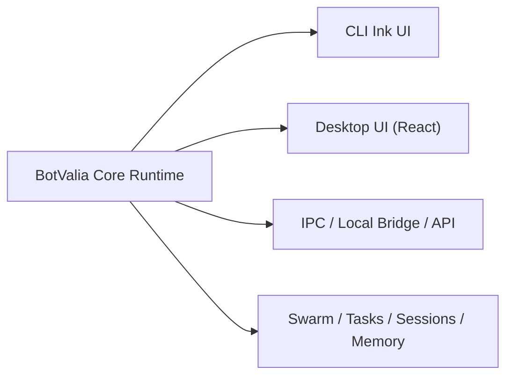

# BotValia Desktop Plan

## Objetivo

Construir `BotValia Desktop` reutilizando el mismo motor que hoy usa el CLI,
sin rehacer la lógica de:

- sesiones
- tools
- QueryEngine
- routing de modelos
- swarm / teammates
- memoria y recuperación

La meta no es "meter el terminal en una ventana". La meta es separar el motor
del render terminal para que BotValia tenga:

1. un **core runtime**
2. un **cliente CLI**
3. un **cliente desktop**

## Recomendación principal

### Sí: mismo motor

Lo correcto es usar el mismo motor de BotValia.

### No: envolver Ink tal cual

No conviene construir desktop simplemente incrustando el CLI actual dentro de
Electron/Tauri como si fuera una terminal glorificada. Eso sirve para un MVP
rápido, pero deja problemas:

- UX limitada
- integración pobre con paneles y previews
- estado duplicado
- testing más frágil
- peor control sobre swarm, archivos y tareas

## Arquitectura recomendada



## Qué ya existe y nos ayuda

Estas piezas ya apuntan a una futura desktop:

- motor conversacional:
  - [src/query.ts](/C:/Users/jhcamachov/Documents/GitHub/PERSONAL/botvalia-code/src/query.ts)
  - [src/QueryEngine.ts](/C:/Users/jhcamachov/Documents/GitHub/PERSONAL/botvalia-code/src/QueryEngine.ts)
- inicialización principal:
  - [src/main.tsx](/C:/Users/jhcamachov/Documents/GitHub/PERSONAL/botvalia-code/src/main.tsx)
- bridge y comunicación:
  - [src/bridge](/C:/Users/jhcamachov/Documents/GitHub/PERSONAL/botvalia-code/src/bridge)
  - [src/server](/C:/Users/jhcamachov/Documents/GitHub/PERSONAL/botvalia-code/src/server)
  - [src/remote](/C:/Users/jhcamachov/Documents/GitHub/PERSONAL/botvalia-code/src/remote)
- swarm y teammates:
  - [src/commands/swarm/swarm.tsx](/C:/Users/jhcamachov/Documents/GitHub/PERSONAL/botvalia-code/src/commands/swarm/swarm.tsx)
  - [src/components/swarm/SwarmDialog.tsx](/C:/Users/jhcamachov/Documents/GitHub/PERSONAL/botvalia-code/src/components/swarm/SwarmDialog.tsx)
  - [src/utils/swarm](/C:/Users/jhcamachov/Documents/GitHub/PERSONAL/botvalia-code/src/utils/swarm)
- estado y app shell:
  - [src/state](/C:/Users/jhcamachov/Documents/GitHub/PERSONAL/botvalia-code/src/state)
  - [src/bootstrap/state.ts](/C:/Users/jhcamachov/Documents/GitHub/PERSONAL/botvalia-code/src/bootstrap/state.ts)

## Arquitectura objetivo

### Capa 1: `botvalia-core`

Debe contener:

- lifecycle de sesión
- QueryEngine
- herramientas y permisos
- selección de modelos y fallbacks
- tasks y swarm
- memoria local
- eventos de progreso
- recuperación de sesión

Debe exponer algo como:

```ts
type BotValiaRuntime = {
  startSession(input?: SessionConfig): Promise<SessionHandle>
  sendUserMessage(sessionId: string, text: string): Promise<void>
  interrupt(sessionId: string): Promise<void>
  listTasks(sessionId: string): Promise<TaskInfo[]>
  listSwarm(sessionId: string): Promise<SwarmState>
  sendSwarmMessage(sessionId: string, payload: SwarmMessageInput): Promise<void>
  onEvent(listener: (event: RuntimeEvent) => void): Unsubscribe
}
```

### Capa 2: `botvalia-cli`

Mantiene:

- Ink
- slash commands
- rendering terminal
- keybindings
- input interactivo

Pero deja de cargar directamente toda la lógica interna y pasa a consumir
`botvalia-core`.

### Capa 3: `botvalia-desktop`

App visual con:

- chat principal
- panel de swarm en vivo
- estado de tareas
- archivos cambiados
- diffs
- modelo/modo actual
- panel de tools
- memoria / RAG / notas del proyecto
- preview visual cuando aplique

## Tecnología recomendada

### Opción recomendada: Tauri + React

Ventajas:

- ligera
- mejor footprint que Electron
- buena integración desktop
- ideal si el runtime sigue siendo Node/Bun como proceso sidecar

### Opción más rápida: Electron + React

Ventajas:

- ecosistema enorme
- más sencillo para prototipos
- fácil para terminal embebida / webviews / fs

Desventaja:

- más pesada

## Recomendación final de stack

Para BotValia Desktop hoy:

- **frontend**: React
- **desktop shell**: Tauri si queremos producto serio y liviano
- **runtime**: proceso Node/Bun separado usando el mismo core
- **comunicación**: IPC local o WebSocket local

## Lo que no hay que hacer

- no acoplar la desktop directamente a componentes Ink
- no duplicar QueryEngine para desktop
- no tener un "motor CLI" y otro "motor app"
- no esconder el CLI dentro de una webview como solución final

## Fases

## Fase 1: separar el core

Objetivo:

extraer la lógica de runtime del arranque terminal.

Trabajo:

- mover lógica reutilizable desde [src/main.tsx](/C:/Users/jhcamachov/Documents/GitHub/PERSONAL/botvalia-code/src/main.tsx) a una capa `runtime/` o `core/`
- exponer API programática para:
  - iniciar sesión
  - mandar prompt
  - escuchar eventos
  - listar tasks
  - manipular swarm
- definir eventos unificados:
  - `message_delta`
  - `message_done`
  - `tool_started`
  - `tool_finished`
  - `task_updated`
  - `swarm_updated`
  - `model_switched`
  - `error`

Resultado esperado:

- el CLI sigue funcionando
- ya existe un runtime consumible sin Ink

## Fase 2: crear un bridge local estable

Objetivo:

permitir que otro cliente controle el runtime.

Trabajo:

- crear transporte local por IPC o WebSocket
- soportar múltiples sesiones
- permitir subscribe/unsubscribe a eventos
- permitir acciones:
  - sendMessage
  - interrupt
  - openSwarm
  - sendSwarmMessage
  - fetchTranscript

Resultado esperado:

- BotValia puede correr como servicio local
- el CLI y la desktop pueden hablar con el mismo runtime

Estado actual del bridge:

- [src/runtime/runtimeWsServer.ts](/C:/Users/jhcamachov/Documents/GitHub/PERSONAL/botvalia-code/src/runtime/runtimeWsServer.ts)
- [src/runtime/runtimeWsClient.ts](/C:/Users/jhcamachov/Documents/GitHub/PERSONAL/botvalia-code/src/runtime/runtimeWsClient.ts)
- [src/runtime/runtimeServerManager.ts](/C:/Users/jhcamachov/Documents/GitHub/PERSONAL/botvalia-code/src/runtime/runtimeServerManager.ts)
- [src/runtime/runtimeInspectorServer.ts](/C:/Users/jhcamachov/Documents/GitHub/PERSONAL/botvalia-code/src/runtime/runtimeInspectorServer.ts)
- comando `/runtime` para levantar, consultar y apagar el bridge local
- `/runtime ui` y `/runtime open` para ver una UI mínima sobre sesiones y eventos

## Fase 3: desktop MVP

Objetivo:

tener una app usable.

Pantallas mínimas:

- Home / lista de sesiones
- Chat principal
- panel lateral de archivos y cambios
- panel de swarm
- estado del modelo
- logs / tools / tasks

Resultado esperado:

- MVP funcional usando el mismo motor del CLI

## Fase 4: ventajas reales sobre el CLI

Objetivo:

hacer que desktop no sea solo "el CLI con ventana".

Features:

- vista del swarm en vivo
- grafo de conversaciones entre agentes
- timeline de tools
- diffs aprobables visualmente
- preview de archivos
- navegador embebido para pruebas
- perfiles activables:
  - UX/UI
  - QA
  - Security
  - Product
  - Reviewer

## Fase 5: memoria local y RAG serio

Objetivo:

hacer que desktop se sienta más inteligente y barata en tokens.

Trabajo:

- embeddings locales opcionales
- índice persistente del repo y documentos
- recuperación por proyecto
- recuerdos por sesión y por equipo

## UX recomendada

La app desktop debería hacer muy visible:

- modo actual:
  - `Auto (All)`
  - `Auto (OpenRouter)`
  - `Auto (Ollama)`
  - `Manual`
- modelo real que respondió
- fallback actual
- agentes activos
- quién espera a quién
- tools corriendo
- archivos tocados

## Pantallas recomendadas

### 1. Chat principal

- input principal
- transcript limpio
- estado del modelo
- chips de contexto

### 2. Swarm Board

- lista de agentes
- threads
- waiting / blockers
- mensajería directa
- timeline de coordinación

### 3. Work Panel

- archivos cambiados
- diff
- tests
- artifacts generados

### 4. Memory Panel

- notas del proyecto
- recuerdos persistentes
- resultados del RAG local

### 5. Settings / Profiles

- perfiles activables:
  - UX/UI
  - QA
  - Security
  - Reviewer
  - PM

## Prioridad real

El orden correcto no es "hacer primero la app bonita". El orden correcto es:

1. separar core
2. exponer bridge/runtime
3. desktop MVP
4. swarm visual
5. memoria local fuerte

## Primera iteración concreta

La primera iteración que sí recomiendo implementar ya es:

1. crear carpeta `src/runtime/`
2. mover allí una API mínima de sesión
3. dejar al CLI consumir esa API
4. crear un `desktop-prototype/` o `apps/desktop/`
5. conectar una UI mínima de chat a ese runtime

## Criterio de éxito

Sabremos que vamos bien cuando:

- el mismo prompt pueda ejecutarse igual desde CLI y desktop
- el mismo swarm pueda verse desde ambas interfaces
- el modelo, fallback y tasks estén sincronizados
- no haya lógica duplicada entre CLI y desktop

## Próximo paso recomendado

Después de este documento, el siguiente paso técnico real es:

**crear la Fase 1 del runtime extraíble**:

- `src/runtime/sessionRuntime.ts`
- `src/runtime/events.ts`
- `src/runtime/types.ts`

y mover ahí el primer camino mínimo:

- start session
- send prompt
- stream response
- expose task/swarm state

Ese sería el primer paso serio para que BotValia Desktop nazca bien.
