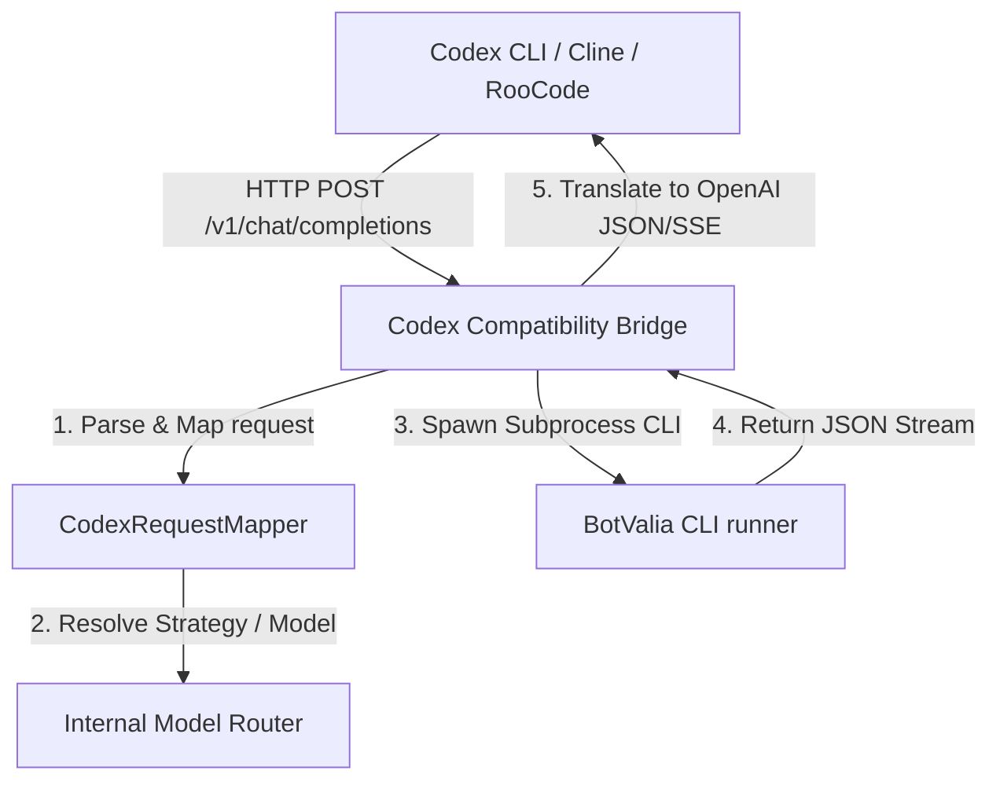

# Codex Compatibility Bridge Integration

This integration allows the [Codex CLI](https://github.com/OpenAI/codex-cli) (and other OpenAI-compatible client tools like Cline, RooCode, Continue, etc.) to connect to BotValia CLI as a custom provider.

## Architecture

The bridge starts an HTTP server using `Bun.serve` that exposes OpenAI-compatible REST endpoints. Incoming requests are translated to internal BotValia prompt/system prompts and processed through the local orchestrator routing engine.



## Configured Endpoints

- **`GET /health`**: Health status endpoint. Returns 200 OK.
- **`GET /v1/models`**: Returns the list of virtual models exposed by the bridge.
- **`POST /v1/chat/completions`**: Main completion endpoint supporting both non-streaming and Server-Sent Events (SSE) streaming (`stream: true`).

## Options & Settings Configuration

The bridge settings can be configured in your `settings.json` file inside the `codexBridge` object:

```json
{
  "codexBridge": {
    "enabled": true,
    "host": "127.0.0.1",
    "port": 5008,
    "authToken": "optional-secure-token",
    "virtualModel": "botvalia-smart",
    "defaultStrategy": "coding",
    "allowTools": false,
    "models": [
      { "id": "botvalia-smart", "strategy": "coding", "route": "auto-openrouter" },
      { "id": "botvalia-coding", "strategy": "coding", "route": "auto-openrouter" },
      { "id": "botvalia-architecture", "strategy": "architecture", "route": "auto-openrouter" },
      { "id": "botvalia-cheap", "strategy": "cheap", "route": "openrouter::google/gemma-3-4b-it:free" },
      { "id": "botvalia-free", "strategy": "free", "route": "openrouter::openrouter/free" },
      { "id": "botvalia-local", "strategy": "local", "route": "auto-ollama" },
      { "id": "botvalia-reasoning", "strategy": "reasoning", "route": "openrouter::deepseek/deepseek-r1:free" },
      { "id": "botvalia-dotnet", "strategy": "coding", "route": "auto-openrouter" },
      { "id": "botvalia-fullstack", "strategy": "coding", "route": "auto-openrouter" },
      { "id": "botvalia-python", "strategy": "coding", "route": "auto-openrouter" }
    ]
  }
}
```

## Running the Bridge Command

Start the bridge server by running:

```bash
botvalia codex-bridge
```

You can optionally customize parameters via flags:

```bash
botvalia codex-bridge --port 5008 --host 127.0.0.1 --auth-token YOUR_SECRET_KEY
```

## Codex CLI configuration (`config.toml`)

Append the following configuration blocks to your `~/.codex/config.toml` file to route requests to the bridge:

```toml
[model_providers.botvalia]
name = "botvalia"
base_url = "http://localhost:5008/v1"
api_key_env = "BOTVALIA_API_KEY"

[profiles.smart]
model = "botvalia-smart"
model_provider = "botvalia"

[profiles.free]
model = "botvalia-free"
model_provider = "botvalia"

[profiles.local]
model = "botvalia-local"
model_provider = "botvalia"

[profiles.reasoning]
model = "botvalia-reasoning"
model_provider = "botvalia"

[profiles.architect]
model = "botvalia-architect"
model_provider = "botvalia"

[profiles.cheap]
model = "botvalia-cheap"
model_provider = "botvalia"

[profiles.dotnet]
model = "botvalia-dotnet"
model_provider = "botvalia"

[profiles.fullstack]
model = "botvalia-fullstack"
model_provider = "botvalia"

[profiles.fastapi]
model = "botvalia-python"
model_provider = "botvalia"
```
